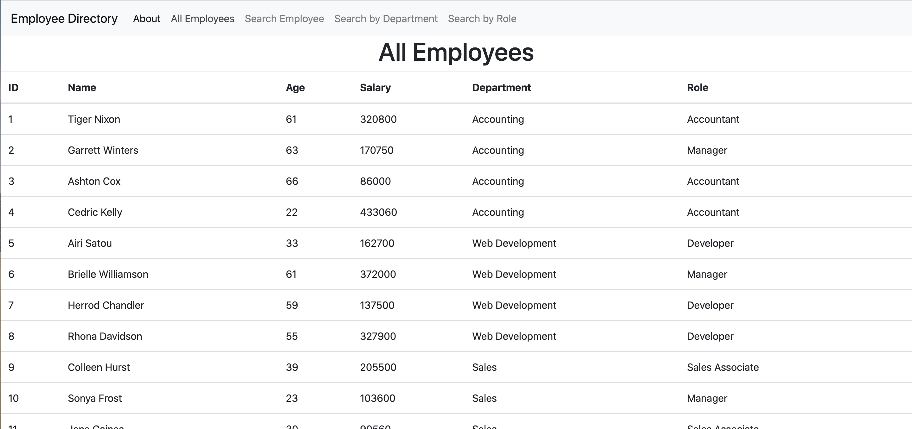
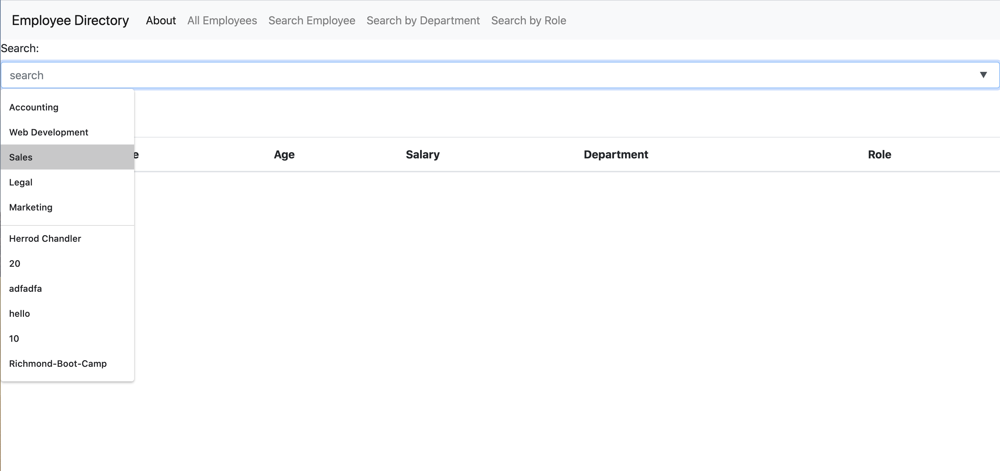
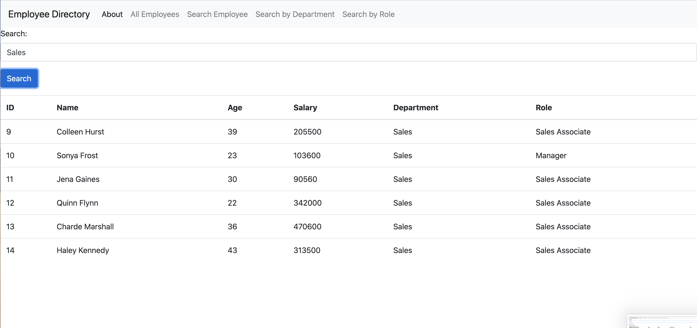

# Employee Directory README

# Table of contents
1. [Project Description](#descriptionLink)
2. [Usage](#usageLink)
3. [UI](#uiLink)
4. [Version](#versionLink)
5. [Stack](#dependenciesLink)
6. [Contact](#contactLink)


----

## Project Descripton <a name="descriptionLink"></a>
This Employee Directory uses React.js for its front end development. A user can view a table of all employees, or search by name, role, or department.

## Usage <a name="usageLink"></a>
To install dependencies run ```npm i```]

To start application, run ```npm start```

## UI <a name="uiLink"></a>





## Version <a name="versionLink"></a>


## Stack  <a name="dependenciesLink"></a>

-React.js

## Contact <a name="contactLink"></a>


 
#### Github Username: [@reyesdmusic](https://www.github.com/reyesdmusic)
#### Email: reyesdmusic@gmail.com
